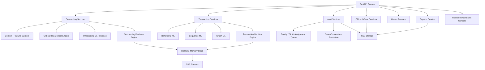
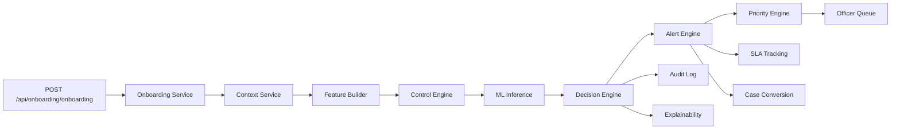
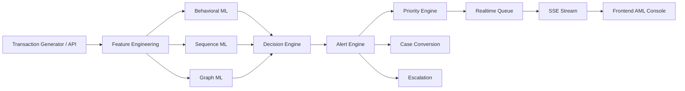
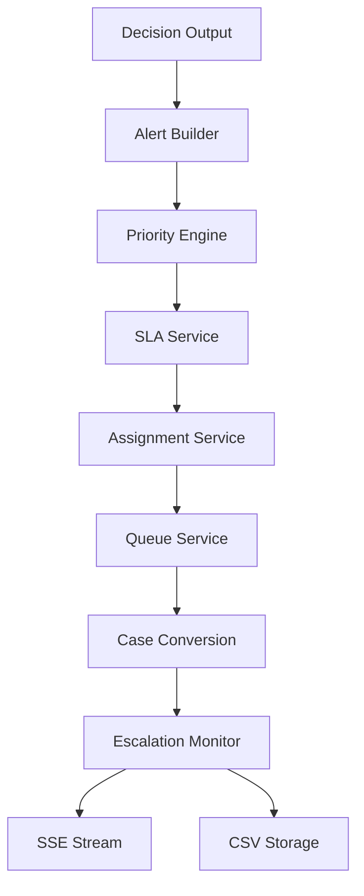

# TrustVault AML Backend

TrustVault AML is a realtime AML intelligence platform for onboarding screening, post-transaction monitoring, operational alerting, officer review, case conversion, and escalation management. The backend is designed as an enterprise orchestration layer rather than a single model endpoint: API routes validate and route requests, service layers perform context enrichment and ML fusion, alert services operationalize outcomes, and realtime streams publish live operational events to the frontend.

## 1. Project Overview

The system supports two core AML domains:

- Onboarding AML for identity trust, device trust, SIM intelligence, sanctions screening, and EDD routing.
- Transaction AML for realtime fraud simulation, behavioral scoring, sequence analysis, graph intelligence, alert prioritization, and officer workflow orchestration.

The current backend behaves like a bank AML operations center:

- It accepts onboarding and transaction events.
- It evaluates them through existing ML and decision engines.
- It converts risk into operational alerts, SLA records, queue assignments, and cases.
- It streams live events over SSE to the frontend.
- It persists operational artifacts to CSV-backed storage for auditability and replayability.

### Enterprise operating principles

- Keep onboarding and transaction ML architecture intact.
- Keep inference behind service boundaries, not in routes.
- Centralize model loading and reuse loaded artifacts.
- Separate decisioning from alert orchestration.
- Preserve explainability, auditability, and officer traceability for every actionable event.
- Treat realtime output as an operational workflow, not just a chart feed.

## 2. System Architecture



### Current backend directory map

```text
backend/
├── main.py
├── README.md
├── requirements.txt
├── app/
│   ├── api/
│   │   ├── alerts_routes.py
│   │   ├── case_routes.py
│   │   ├── dashboard_routes.py
│   │   ├── graph_routes.py
│   │   ├── health_routes.py
│   │   ├── officer_routes.py
│   │   ├── onboarding_routes.py
│   │   ├── transaction_routes.py
│   │   └── v1/
│   │       └── reports.py
│   ├── core/
│   │   ├── model_loader.py
│   │   └── policy_engine.py
│   ├── db/
│   │   └── file_storage.py
│   ├── models/
│   │   ├── metadata/
│   │   ├── onboarding/
│   │   └── transaction/
│   ├── realtime/
│   │   ├── transaction_generator.py
│   │   ├── transaction_memory_store.py
│   │   ├── realtime_engine.py
│   │   ├── transaction_streamer.py
│   │   └── alerts_streamer.py
│   ├── services/
│   │   ├── onboarding/
│   │   ├── transaction/
│   │   ├── officer/
│   │   ├── shared/
│   │   └── alerts/
│   ├── schemas/
│   └── utils/
├── data/
│   └── processed/
├── scripts/
└── training/
```

### Responsibilities by layer

| Layer | Responsibility |
|---|---|
| `app/api/` | HTTP endpoints, input validation, response shaping, SSE routers |
| `app/core/` | Central model loader, policy/threshold configuration, boot-time orchestration |
| `app/services/onboarding/` | Onboarding context, feature building, control engine, decisioning, explainability, audit |
| `app/services/transaction/` | Transaction orchestration, behavioral ML, sequence ML, graph ML, decision fusion |
| `app/services/alerts/` | Priority, SLA, assignment, queueing, escalation, alert storage, case conversion |
| `app/services/officer/` | Officer case management, review, whitelist overrides, operational actioning |
| `app/services/shared/` | Shared reporting and audit utilities |
| `app/realtime/` | Transaction generator, in-memory operational store, SSE publishing, realtime engine |
| `app/db/` | CSV/file persistence adapters |
| `app/models/` | Model artifacts and metadata |
| `training/` | Offline training and feature generation pipelines |

## 3. Onboarding AML Flow



### Onboarding responsibilities

- `OnboardingService` orchestrates the request lifecycle.
- `OnboardingContextService` enriches onboarding with SIM, device, IP, and trust context.
- `OnboardingControlService` applies hard controls such as sanctions, emulator, VPN, SIM swap, and suspicious interaction patterns.
- `OnboardingFeatureBuilder` generates the onboarding model input vector.
- `OnboardingDecisionEngine` combines control signals and ML output into allow/block/review decisions.
- `OnboardingExplainabilityService` converts onboarding signals into officer-readable rationale.
- `OnboardingAuditService` stores the operational trail.
- `onboarding_alert_service.py` turns risky onboarding outcomes into operational alerts.

### Onboarding signal family

| Signal | Why it matters |
|---|---|
| `device_trust_score` | Low device trust often correlates with emulation, tampering, or shared device risk |
| `sim_binding_ok` | Weak SIM binding can indicate takeover, synthetic onboarding, or SIM fraud |
| `sim_swap_flag` | Recent SIM swaps are a common account takeover precursor |
| `vpn_flag` | VPN and hosting-origin traffic can indicate concealment or synthetic onboarding |
| `sanction_hit` | Immediate regulatory block or review trigger |
| `copy_paste_ratio` | Elevated copy/paste usage can indicate scripted or synthetic enrollment |
| `typing_speed` | Low human-likeness can indicate automation or bot activity |
| `face_match_score` | Biometric mismatch weakens identity trust |
| `device_shared_count` | Shared devices often correlate with mule networks or synthetic clusters |

### Onboarding flow outcome

1. API receives onboarding data.
2. Context and control layers enrich the request.
3. Feature builder constructs the input row.
4. Onboarding ML scores trust.
5. Decision engine resolves allow, review, or block.
6. Explainability and audit records are written.
7. Alert services can create onboarding alerts and push them to officer queues.

## 4. Transaction AML Flow



### Transaction responsibilities

- `TransactionService` processes API-submitted transactions.
- `realtime_engine.py` continuously generates transactions for live simulation and operational testing.
- `MLBehaviorService` scores transaction behavior.
- `SequenceModelService` scores recent ordered transaction windows.
- `GraphIntelligenceEngine` scores fraud proximity, layering, shared infrastructure, and community risk from Neo4j.
- `DecisionEngine` fuses the model outputs and rule/control results into a final decision.
- `transaction_alert_service.py` converts high-risk decisions into operational alerts.
- `alert_priority_service.py`, `sla_service.py`, `alert_assignment_service.py`, and `alert_queue_service.py` operationalize the alert.

### Transaction flow outcome

1. A transaction arrives from API or generator.
2. Behavioral, sequence, and graph scoring run independently.
3. Decision engine fuses the scores.
4. Alert service derives operational severity and queue placement.
5. SLA service calculates deadlines.
6. Assignment service routes the alert to an officer.
7. Queue and case services persist the operational state.
8. SSE publishes the new event to the console.

## 5. ML Model Documentation

### A. Behavioral model

Purpose:

- Detect transaction fraud and AML behavior at row level.
- Flag structuring, draining, pass-through movement, and threshold gaming.

Inputs:

- Transaction amount and balance movement.
- Velocity, drain ratio, forwarding delay, and fragmentation.
- Device, network, SIM, and graph-derived context.

Outputs:

```json
{
    "behavior_score": 0.91,
    "behavior_label": "HIGH_RISK",
    "top_features": ["drain_ratio", "txn_velocity_1h"],
    "reasons": ["rapid drain pattern", "velocity spike"]
}
```

### B. Sequence model

Purpose:

- Identify temporal laundering patterns across recent transactions.
- Detect gather-scatter and layering sequences.

Temporal logic:

- Uses the most recent transaction window, typically the last 10 records.
- If history is insufficient, it degrades safely and returns an insufficient-history status.

Output:

```json
{
    "sequence_score": 0.88,
    "sequence_pattern": "GATHER_SCATTER"
}
```

### C. Graph model

Purpose:

- Score proximity to suspicious accounts, mule clusters, and fraud neighborhoods.
- Support graph-based AML intelligence and network expansion analysis.

Signals:

- Known fraud neighbors.
- Cluster risk.
- Graph proximity to suspicious actors.

Output:

```json
{
    "graph_score": 0.82,
    "cluster_risk": "HIGH",
    "known_fraud_neighbors": 4
}
```

### D. Onboarding model

Purpose:

- Score onboarding trust and synthetic identity risk.
- Support EDD, sanctions, and high-risk onboarding routing.

Output:

```json
{
    "ml_probability": 0.96,
    "ml_label": "SUSPICIOUS",
    "top_features": ["vpn_flag", "device_trust_score"]
}
```

## 6. Feature Engineering Details

### Transaction features

| Feature | Why it matters |
|---|---|
| `txn_velocity_1h` | Sudden transaction bursts often indicate mule routing or account takeover |
| `drain_ratio` | High drain ratios are common in cash-out and rapid-forwarding patterns |
| `forwarding_delay_mins` | Short delays suggest pass-through or laundering chains |
| `device_shared_count` | Shared devices correlate with fraud rings and synthetic accounts |
| `graph_centrality` | High network centrality can indicate a hub in a laundering cluster |
| `SIM risk` | SIM volatility is a strong takeover and synthetic identity signal |
| `VPN flags` | Concealed origin and hosting usage often correlates with higher fraud risk |
| `copy_paste_ratio` | Automation and scripted onboarding behavior show up as high copy/paste |
| `geo mismatch` | Location mismatch can indicate proxy abuse or remote control |
| `timestamp drift` | Clock or session anomalies can indicate automation or tampering |

### Why these features matter operationally

- They provide a layered view of risk instead of a single score.
- They support explainability for investigators.
- They help separate fast benign behavior from suspicious laundering behavior.
- They drive alert prioritization and case conversion.

## 7. Alerting & Prioritization

The alerting layer converts ML and decision outputs into operational work items.

### Priority thresholds

| Priority | Threshold | Severity | SLA | Escalation timeout | Queue |
|---|---:|---|---:|---:|---|
| P1 | `final_score >= 0.92` | Critical | 15 min | 20 min | `AML_CRITICAL_QUEUE` |
| P2 | `final_score >= 0.75` | High | 2 hr | 3 hr | `AML_REVIEW_QUEUE` |
| P3 | `final_score >= 0.50` | Medium | 24 hr | 48 hr | `AML_MONITORING_QUEUE` |
| INFO | otherwise | Low | 7 days | 14 days | `AML_INFO_QUEUE` |

### Alert orchestration pattern



### Alert types

- Onboarding alerts for synthetic identity, sanctions, emulator, mule onboarding, SIM swap, and VPN risk.
- Transaction alerts for rapid drain, gather-scatter, mule routing, high velocity, layering, fraud clusters, and pass-through behavior.

### Alert lifecycle

```text
OPEN -> ACKNOWLEDGED -> IN_REVIEW -> ESCALATED -> CLOSED
                                         \-> FALSE_POSITIVE
```

### Queue architecture

- `P1_QUEUE` for critical bank-risk events.
- `P2_QUEUE` for elevated review cases.
- `P3_QUEUE` for monitored-but-actionable signals.
- `EDD_QUEUE` for enhanced due diligence routing.
- `MANUAL_REVIEW_QUEUE` for non-automated officer follow-up.

### Officer assignment behavior

- Alerts are assigned across simulated officers `OFFICER-01`, `OFFICER-02`, `OFFICER-03`, and `SUPERVISOR-01`.
- High-priority alerts route to the `AML_HIGH_RISK` team.
- Lower priorities route to review or monitoring teams.
- Escalation re-routes overdue items to supervisor review.

### Case conversion rules

- All P1 alerts convert to cases.
- Repeated P2 alerts can convert to cases.
- Mule cluster and sanctions alerts convert to cases automatically.

## 8. Realtime Engine

### SSE architecture

The backend uses Server-Sent Events for lightweight realtime delivery:

- `GET /api/transactions/realtime` streams transaction events.
- `GET /api/alerts/realtime` streams alert, escalation, assignment, and queue events.

### Memory stores

- `LIVE_TRANSACTIONS` stores recent transaction outputs and is now the preferred source for recent-transaction context.
- `LIVE_ALERTS` stores recent operational alerts.
- `LIVE_GRAPH_EVENTS` stores network updates for the graph explorer.
- `DASHBOARD_METRICS` stores live counters such as blocked transactions, review queue size, and high-risk counts.

### Transaction generator

`transaction_generator.py` simulates realistic AML attack patterns:

- Normal payments.
- Mule forwarding.
- Velocity attacks.
- Layering patterns.

### Event propagation

```text
Generator -> ML Services -> Decision Engine -> Alert Services -> Memory Store -> SSE -> Frontend
```

### Dashboard metrics

- Total transactions.
- Blocked transactions.
- Review queue.
- High-risk count.

## 9. API Documentation

### Health APIs

| Method | Route | Purpose | Sample response |
|---|---|---|---|
| GET | `/api/health` | Service health check | `{"status":"OK","service":"TrustVault AML Engine","uptime_sec":123}` |
| GET | `/api/ready` | Readiness and engine status | `{"status":"READY","ml_engine":"ACTIVE","graph_engine":"ACTIVE","control_engine":"ACTIVE"}` |

### Onboarding APIs

| Method | Route | Purpose | Sample response |
|---|---|---|---|
| POST | `/api/onboarding/onboarding` | Run onboarding AML workflow | `{"decision":"BLOCK","ml_probability":0.96,"risk_score":96,"report_type":"HIGH_RISK_ONBOARDING"}` |

### Transaction APIs

| Method | Route | Purpose | Sample response |
|---|---|---|---|
| POST | `/api/transactions` | Score a transaction through the AML pipeline | `{"trans_id":"TXN-1","decision":"REVIEW","final_score":0.84,"behavior_score":0.91,"sequence_score":0.88,"graph_score":0.82}` |
| GET | `/api/transactions/recent` | Return current live transaction snapshot | `[{"trans_id":"TXN-1","decision":"BLOCK"}]` |
| GET | `/api/transactions/realtime` | SSE stream of live transaction events | `event: transaction\ndata: {...}` |

### Alerts APIs

| Method | Route | Purpose | Sample response |
|---|---|---|---|
| GET | `/api/alerts` | Return all live alerts | `[{"alert_id":"TXN-2211","priority":"P1"}]` |
| GET | `/api/alerts/p1` | Return critical alerts | `[{"alert_id":"TXN-2211","priority":"P1"}]` |
| GET | `/api/alerts/p2` | Return high alerts | `[{"alert_id":"TXN-2212","priority":"P2"}]` |
| GET | `/api/alerts/officer/{officer_id}` | Return alerts assigned to one officer | `[{"assigned_officer":"OFFICER-02"}]` |
| GET | `/api/alerts/queue` | Return queue snapshot and sizes | `{"P1_QUEUE":{"size":2,"oldest":{...}}}` |
| GET | `/api/alerts/escalations` | Evaluate and return escalated alerts | `[{"alert_id":"TXN-2211","escalated_to":"SUPERVISOR-01"}]` |
| POST | `/api/alerts/{id}/acknowledge` | Acknowledge an alert | `{"status":"ok"}` |
| POST | `/api/alerts/{id}/close` | Close an alert | `{"status":"ok"}` |
| POST | `/api/alerts/{id}/escalate` | Escalate an alert | `{"escalated":true,"escalated_to":"SUPERVISOR-01"}` |
| GET | `/api/alerts/realtime` | SSE stream of alert events | `event: alert\ndata: {...}` |

### Case APIs

| Method | Route | Purpose | Sample response |
|---|---|---|---|
| GET | `/api/cases` | List case registry entries | `[{"case_id":"CASE-991","status":"OPEN"}]` |
| GET | `/api/cases/{id}` | Retrieve one case | `{"case_id":"CASE-991","priority":"P1"}` |
| POST | `/api/cases/create` | Create a case record | `{"case_id":"CASE-991","status":"OPEN"}` |
| POST | `/api/cases/{id}/assign` | Assign a case to an officer | `{"status":"ok"}` |
| POST | `/api/cases/{id}/freeze` | Freeze a case | `{"status":"ok"}` |
| POST | `/api/cases/{id}/sar` | Generate SAR action record | `{"status":"ok"}` |

### Graph APIs

| Method | Route | Purpose | Sample response |
|---|---|---|---|
| GET | `/api/graph/network` | Return live graph nodes and edges | `{"nodes":[{"id":"U-100"}],"edges":[{"source":"U-100","target":"M-222"}]}` |

### Dashboard APIs

| Method | Route | Purpose | Sample response |
|---|---|---|---|
| GET | `/api/dashboard/metrics` | Return live operational metrics | `{"total_transactions":101,"blocked_transactions":8,"review_queue":5,"high_risk_count":4}` |

### Officer APIs

| Method | Route | Purpose | Sample response |
|---|---|---|---|
| POST | `/api/officer/case/create` | Auto-create an officer case | `{"case_id":"CASE-1","status":"OPEN"}` |
| GET | `/api/officer/case/all` | Return officer case list | `[{"case_id":"CASE-1"}]` |
| POST | `/api/officer/case/resolve` | Resolve a case with officer decision | `{"status":"resolved"}` |
| POST | `/api/officer/whitelist` | Add user to whitelist | `{"status":"ok"}` |

### Reports APIs

| Method | Route | Purpose | Sample response |
|---|---|---|---|
| GET | `/api/reports` | Return all filtered reports | `[{"report_type":"SAR","report_id":"REP-1"}]` |
| GET | `/api/reports/sar` | SAR-only report list | `[{"report_type":"SAR"}]` |
| GET | `/api/reports/str` | STR-only report list | `[{"report_type":"STR"}]` |
| GET | `/api/reports/high-risk` | High-risk onboarding / mule alerts | `[{"report_type":"HIGH_RISK_ONBOARDING"}]` |
| GET | `/api/reports/manual-review` | Manual review reports | `[{"report_type":"MANUAL_REVIEW_ESCALATION"}]` |

## 10. Storage & Data Layer

The backend remains CSV-backed by design so that the operational lifecycle is easy to inspect and replay during development.

### Primary storage locations

| Data | Location |
|---|---|
| Reports | `data/processed/reports.csv` |
| Control decisions | `data/processed/control_decisions.csv` |
| Explainability logs | `data/processed/explainability_log.csv` |
| Onboarding alerts | `data/processed/alerts/onboarding_alerts.csv` |
| Transaction alerts | `data/processed/alerts/transaction_alerts.csv` |
| Officer queue snapshots | `data/processed/alerts/officer_queue.csv` |
| Case registry | `data/processed/alerts/case_registry.csv` |
| SLA tracking | `data/processed/alerts/sla_tracking.csv` |
| Escalation log | `data/processed/alerts/escalation_log.csv` |
| Officer cases | `data/processed/officer_cases.csv` |

### Storage behavior

- Append-only for auditability.
- Centralized storage logic for alerts and cases.
- No ML logic in file adapters.
- The system degrades safely if a file is missing and recreates alert CSVs on startup when needed.

## 11. Realtime Simulation

The realtime engine simulates operational AML traffic rather than only replaying static samples.

### Simulated behaviors

- Normal customer traffic.
- Velocity attacks.
- Mule routing.
- Layering and gather-scatter sequences.
- Fraud cluster propagation across graph neighbors.

### Simulation loop

```text
generate_transaction() -> process_transaction() -> create alert -> update metrics -> publish SSE event
```

### Operational realism features

- P1 alerts remain visible at the top of the queue.
- Live alerts can escalate if SLA timers are breached.
- Graph updates are emitted alongside transaction events.
- Dashboard metrics update continuously from the in-memory store.

## 12. Frontend Integration

The backend is designed to feed an enterprise operations console through SSE and query APIs.

### Realtime feeds

- Transaction feed: `/api/transactions/realtime`
- Alert feed: `/api/alerts/realtime`
- Queue feed: `/api/alerts/queue`
- Graph feed: `/api/graph/network`
- Metrics feed: `/api/dashboard/metrics`

### Frontend consumers

- Transaction stream components consume the transaction SSE.
- Alert center components consume the alert SSE and the alert list API.
- Officer workbench components consume queue, case, and escalation APIs.
- Graph explorer components consume the live network graph endpoint.

### Operational UX expectations

- Realtime updates must not require page refresh.
- High-risk alerts should be visible immediately.
- Officer actions should create auditable state transitions.
- The console should present operational queues rather than static dashboards.

## 13. Project Setup

### Local environment

From the `backend/` directory:

```powershell
python -m venv .venv
.\.venv\Scripts\Activate.ps1
pip install -r requirements.txt
python -m uvicorn main:app --reload --host 0.0.0.0 --port 8000
```

### Runtime notes

- Run the server from `backend/` so imports and relative paths resolve correctly.
- If a moved virtual environment still points at the old folder layout, recreate it with `python -m venv .venv` before starting the server.
- The FastAPI lifespan warms the behavioral, sequence, and graph model loaders.
- The realtime engine starts on application startup and publishes SSE events to connected clients.

### Environment variables

The baseline backend does not require special environment variables for local development.

- Optional deployment variables can be added later for CORS, host binding, external storage, or event bus integration.
- The frontend should point `VITE_API_URL` at the backend host when consuming SSE and API routes.

## 14. Requirements

### Runtime requirements

| Dependency | Purpose |
|---|---|
| Python 3.10+ | Backend runtime |
| FastAPI | API layer and dependency injection |
| Uvicorn | ASGI server |
| Pydantic | Validation and typed data models |
| sse-starlette | Server-Sent Events transport |
| NumPy / Pandas | Feature handling and CSV processing |
| scikit-learn | Classical ML utilities |
| LightGBM | Gradient-boosted onboarding and behavioral scoring |
| TensorFlow / Keras | Sequence model runtime |
| SciPy / Joblib | Artifact and numerical support |
| Neo4j | Graph traversal, community detection, and native network analytics |

### Operational requirements

- The backend is CSV-backed today.
- Model artifacts must exist in `app/models/` for full fidelity.
- Realtime SSE clients should support reconnect behavior.

## 15. Future Roadmap

The current architecture is designed to evolve into a more distributed enterprise stack.

### Priority roadmap items

- Kafka for production event streaming.
- Redis for distributed queue and session state.
- PostgreSQL for durable alert, case, SLA, and report persistence.
- Neo4j for native network traversal and cluster analytics.
- Distributed graph analytics for higher-volume environments.
- Online learning for adaptive fraud scoring.
- Dedicated event bus for multi-service alert orchestration.

### Suggested enterprise hardening

- Promote alert storage from CSV to relational persistence.
- Move pub/sub from in-memory queues to a shared broker.
- Add SLA watchdog workers for delayed escalation checks.
- Add case collaboration and officer note history.
- Add audit export and regulatory packet generation.

## 16. Operational Notes

- The backend preserves the existing onboarding and transaction ML architecture.
- Routes do not perform inference directly.
- Alert services convert scores into operational action.
- Explainability remains attached to both onboarding and transaction outputs.
- Realtime output is a first-class backend capability, not an afterthought.

## 17. Artifact Checklist

### Onboarding artifacts

- `app/models/onboarding/onboarding_lightgbm.pkl`
- `app/models/onboarding/onboarding_scaler.pkl`
- `app/models/onboarding/onboarding_features.json`
- `app/models/onboarding/onboarding_training_metadata.json`

### Transaction artifacts

- `app/models/transaction/behavioral_lightgbm.pkl`
- `app/models/transaction/behavioral_scaler.pkl`
- `app/models/transaction/behavioral_features.json`
- `app/models/transaction/lstm_sequence_model.h5`
- `app/models/transaction/sequence_scaler.pkl`
- `app/models/transaction/sequence_model_metadata.pkl`
- Neo4j graph data is loaded from the CSV sources into the database at runtime or through `backend/scripts/transaction/load_to_neo4j.py`.

### Metadata files

- `app/models/metadata/model_registry.json`
- `app/models/metadata/threshold_config.json`

If an artifact is missing, the model loader logs a warning and the related service degrades safely rather than failing the application at import time.
